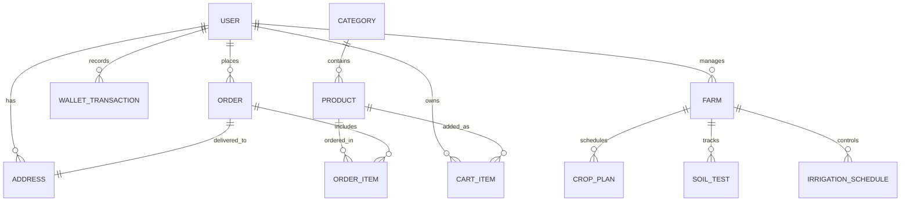

# KrishiGo — Database Architecture

## Overview

KrishiGo uses **SQLAlchemy Async ORM** targeting **SQLite** (`krishigo.db`) in local development and **PostgreSQL** in production environments.

---

## Entity-Relationship Overview

---

## Primary Tables & Schema Definitions

### 1. E-Commerce Core Entities
- **`categories`**: Defines grocery and agricultural categories (id, name, slug, description, image_url, order_index).
- **`products`**: Marketplace inventory with unit weights, base prices, discount percentages, organic certification status, farm origin, stock levels, and ratings.
- **`cart_items`**: User session cart storage tied to authenticated users or anonymous device sessions.
- **`orders`**: Placed customer orders with statuses (`PENDING`, `CONFIRMED`, `OUT_FOR_DELIVERY`, `DELIVERED`, `CANCELLED`), delivery slot times, payment methods (`COD`, `WALLET`, `UPI`, `CARD`), and total amounts.
- **`order_items`**: Individual line items preserving historical product purchase price, quantity, and subtotal.
- **`wallet_transactions`**: Ledger recording user wallet deposits, refunds, and order deductions.

### 2. Farmer Intelligence Entities
- **`farms`**: Geolocation coordinates (latitude, longitude), total acreage, soil classification, primary irrigation source, and owner reference.
- **`crop_plans`**: Sowing calendars, expected harvest dates, crop variety, and acreage allocation.
- **`soil_tests`**: Nitrogen (N), Phosphorus (P), Potassium (K), pH balance, organic carbon percentage, and recommendation logs.
- **`irrigation_schedules`**: Moisture sensors, flow meters, valve statuses, and automated irrigation timers.

---

## Database Management

- Database file: `krishigo.db` (root directory)
- Seed script: `database/seeds/seed.py`
- Connection configuration: `backend/app/core/database.py`
