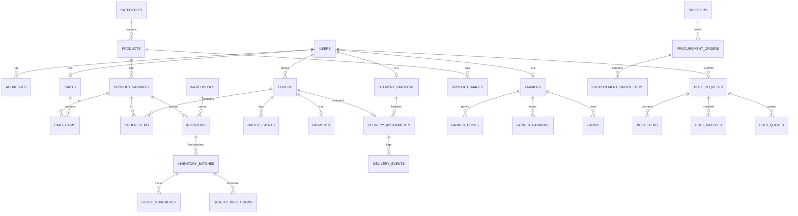

# KrishiGo Database Schema

## Overview

KrishiGo uses PostgreSQL 16 with SQLAlchemy 2.0 (async) and Alembic for migrations.

## Design Conventions

- **Primary Keys**: UUID v4
- **Timestamps**: `created_at`, `updated_at` on all tables
- **Soft Delete**: `is_deleted`, `deleted_at` where appropriate
- **Money**: `Numeric(12, 2)` — never Float
- **Enums**: PostgreSQL native enums
- **Indexes**: On foreign keys, frequently queried columns, and unique constraints

## Entity Relationship Diagram



## Table Definitions

### Core Tables

#### users
| Column | Type | Constraints |
|--------|------|-------------|
| id | UUID | PK |
| email | VARCHAR(255) | UNIQUE, NOT NULL |
| phone | VARCHAR(20) | UNIQUE |
| password_hash | VARCHAR(255) | NOT NULL |
| full_name | VARCHAR(255) | NOT NULL |
| role | UserRole ENUM | NOT NULL, DEFAULT 'CUSTOMER' |
| is_active | BOOLEAN | DEFAULT TRUE |
| is_verified | BOOLEAN | DEFAULT FALSE |
| avatar_url | VARCHAR(500) | |
| created_at | TIMESTAMP | NOT NULL |
| updated_at | TIMESTAMP | NOT NULL |

#### addresses
| Column | Type | Constraints |
|--------|------|-------------|
| id | UUID | PK |
| user_id | UUID | FK → users, NOT NULL |
| name | VARCHAR(255) | NOT NULL |
| phone | VARCHAR(20) | NOT NULL |
| address_line1 | TEXT | NOT NULL |
| address_line2 | TEXT | |
| city | VARCHAR(100) | NOT NULL |
| state | VARCHAR(100) | NOT NULL |
| pincode | VARCHAR(10) | NOT NULL |
| landmark | VARCHAR(255) | |
| latitude | NUMERIC(10, 7) | |
| longitude | NUMERIC(10, 7) | |
| is_default | BOOLEAN | DEFAULT FALSE |
| created_at | TIMESTAMP | NOT NULL |

### Commerce Tables

#### categories
| Column | Type | Constraints |
|--------|------|-------------|
| id | UUID | PK |
| name | VARCHAR(100) | NOT NULL |
| slug | VARCHAR(100) | UNIQUE, NOT NULL |
| description | TEXT | |
| image_url | VARCHAR(500) | |
| parent_id | UUID | FK → categories (self-ref) |
| sort_order | INTEGER | DEFAULT 0 |
| is_active | BOOLEAN | DEFAULT TRUE |

#### products
| Column | Type | Constraints |
|--------|------|-------------|
| id | UUID | PK |
| name | VARCHAR(255) | NOT NULL |
| slug | VARCHAR(255) | UNIQUE, NOT NULL |
| sku | VARCHAR(50) | UNIQUE, NOT NULL |
| category_id | UUID | FK → categories |
| description | TEXT | |
| base_price | NUMERIC(12,2) | NOT NULL |
| unit | VARCHAR(20) | NOT NULL |
| is_organic | BOOLEAN | DEFAULT FALSE |
| is_quick_delivery_eligible | BOOLEAN | DEFAULT TRUE |
| nutritional_info | JSONB | |
| status | ProductStatus ENUM | DEFAULT 'ACTIVE' |
| created_at | TIMESTAMP | |
| updated_at | TIMESTAMP | |

#### product_variants
| Column | Type | Constraints |
|--------|------|-------------|
| id | UUID | PK |
| product_id | UUID | FK → products |
| quality_grade | QualityGrade ENUM | NOT NULL |
| price | NUMERIC(12,2) | NOT NULL |
| compare_at_price | NUMERIC(12,2) | |
| stock_quantity | INTEGER | DEFAULT 0 |
| is_active | BOOLEAN | DEFAULT TRUE |
| UNIQUE | (product_id, quality_grade) | |

### Inventory Tables

#### inventory
| Column | Type | Constraints |
|--------|------|-------------|
| id | UUID | PK |
| warehouse_id | UUID | FK → warehouses |
| product_variant_id | UUID | FK → product_variants |
| physical_qty | NUMERIC(12,2) | DEFAULT 0 |
| reserved_qty | NUMERIC(12,2) | DEFAULT 0 |
| available_qty | NUMERIC(12,2) | DEFAULT 0 |
| min_stock_level | NUMERIC(12,2) | |
| reorder_point | NUMERIC(12,2) | |
| CHECK | available_qty >= 0 | |
| UNIQUE | (warehouse_id, product_variant_id) | |

### Order Tables

#### orders
| Column | Type | Constraints |
|--------|------|-------------|
| id | UUID | PK |
| order_number | VARCHAR(20) | UNIQUE, NOT NULL |
| user_id | UUID | FK → users |
| address_id | UUID | FK → addresses |
| status | OrderStatus ENUM | NOT NULL |
| subtotal | NUMERIC(12,2) | |
| delivery_fee | NUMERIC(12,2) | |
| discount | NUMERIC(12,2) | DEFAULT 0 |
| tax | NUMERIC(12,2) | DEFAULT 0 |
| total | NUMERIC(12,2) | NOT NULL |
| payment_method | VARCHAR(50) | |
| payment_status | PaymentStatus ENUM | |
| delivery_type | VARCHAR(20) | |
| estimated_delivery | TIMESTAMP | |
| warehouse_id | UUID | FK → warehouses |
| created_at | TIMESTAMP | |
| updated_at | TIMESTAMP | |

*See source code for complete table definitions.*

## Concurrency Protection

Inventory reservation uses `SELECT ... FOR UPDATE` to prevent race conditions:

```sql
BEGIN;
SELECT * FROM inventory
WHERE product_variant_id = :variant_id
  AND warehouse_id = :warehouse_id
FOR UPDATE;

-- Check available_qty >= requested_qty
-- Reserve stock
UPDATE inventory SET
  reserved_qty = reserved_qty + :qty,
  available_qty = available_qty - :qty
WHERE id = :inventory_id;

COMMIT;
```
