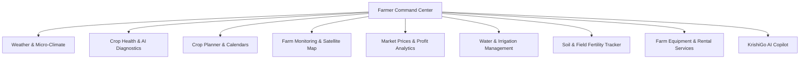

# KrishiGo — Farmer Intelligence Platform Overview

## Overview

KrishiGo Farmer is an advanced agricultural command center designed to empower cultivators with real-time agronomic data, satellite imagery, predictive mandi prices, and artificial intelligence.

---

## Farmer Platform Pages & Capabilities

---

## Directory & Page Mapping

| Page Title | Route | File Path | Key Features |
|---|---|---|---|
| **Farmer Dashboard** | `/farmer` | `frontend/src/pages/farmer/FarmerHomePage.tsx` | Overview metrics, live advisories, quick actions |
| **Weather & Climate** | `/farmer/weather` | `frontend/src/pages/farmer/WeatherPage.tsx` | Hourly/7-day forecast, rain radar, crop warnings |
| **Crop Health AI** | `/farmer/crop-health` | `frontend/src/pages/farmer/CropHealthPage.tsx` | Disease scanner, leaf diagnostic upload, cure plan |
| **Crop Planner** | `/farmer/crop-planner` | `frontend/src/pages/farmer/CropPlannerPage.tsx` | Sowing timetable, nutrient schedule, harvest plan |
| **Farm Monitoring** | `/farmer/monitoring` | `frontend/src/pages/farmer/FarmMonitoringPage.tsx` | Satellite NDVI analysis, field zoning, sensor metrics |
| **Market & Profit** | `/farmer/market-profit`| `frontend/src/pages/farmer/MarketProfitPage.tsx` | Mandi rates, historical price charts, profit math |
| **Irrigation & Water**| `/farmer/irrigation` | `frontend/src/pages/farmer/IrrigationPage.tsx` | Soil moisture telemetry, drip timers, pump control |
| **Soil & Field** | `/farmer/soil-field` | `frontend/src/pages/farmer/SoilFieldPage.tsx` | NPK balance, pH testing, fertilizer recommendations |
| **Farm Services** | `/farmer/services` | `frontend/src/pages/farmer/FarmServicesPage.tsx` | Tractor rental, drone spraying, harvester booking |
| **Farm Management** | `/farmer/management` | `frontend/src/pages/farmer/FarmManagementPage.tsx` | Acreage records, worker payroll, inventory logs |
| **AI Farm Copilot** | `/farmer/copilot` | `frontend/src/pages/farmer/AICopilotPage.tsx` | Interactive Gemini AI farming assistant |
| **Farmer Settings** | `/farmer/settings` | `frontend/src/pages/farmer/SettingsPage.tsx` | Language, notifications, bank account details |

---

## Protection & Stability Guarantee

As stipulated in the Master Specification, the Farmer platform is **LOCKED and PROTECTED**. No routing, UI layout, visual design, or business logic was modified during repository reorganization. All farmer pages remain 100% pixel-faithful and fully operational.
